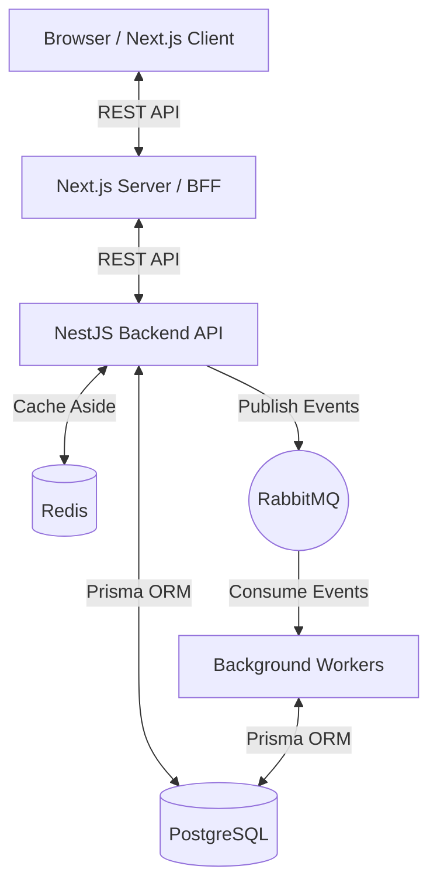
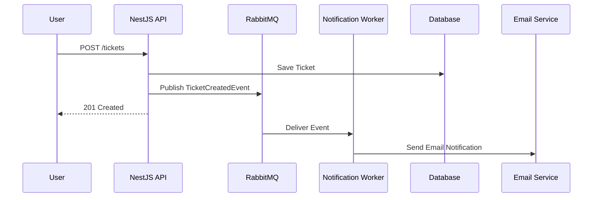
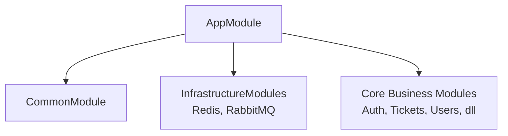

# Arsitektur HelpDeskPro

Dokumen ini menjelaskan arsitektur teknis dari HelpDeskPro.

## High-Level Architecture

Sistem menggunakan pola arsitektur Modular Monolith. Backend dikembangkan dengan NestJS, dan Frontend menggunakan Next.js. Database utama adalah PostgreSQL, Redis digunakan untuk caching, dan RabbitMQ digunakan untuk message broker asinkron.

## Pola CQRS (Lightweight)

HelpDeskPro menggunakan pemisahan tanggung jawab antara Command (Write) dan Query (Read) pada tingkat servis atau controller, tanpa perlu menggunakan full Event Sourcing yang rumit.
- **Commands**: Endpoint POST, PUT, DELETE, PATCH akan langsung menulis ke database dan menerbitkan domain events ke RabbitMQ.
- **Queries**: Endpoint GET akan membaca dari database (dengan optimasi index) atau dari Redis Cache untuk data yang sering diakses.

## Event-Driven Flow (RabbitMQ)

Setiap aksi penting di sistem (seperti `TICKET_CREATED`, `TICKET_ASSIGNED`) akan menerbitkan pesan ke RabbitMQ (exchange `ticket.events`). Background worker yang berjalan terpisah akan mendengarkan pesan-pesan ini untuk melakukan tugas asinkron seperti mengirim email notifikasi, mencatat log aktivitas (audit), dan memperbarui statistik.

## Caching Strategy

Sistem menggunakan **Cache-Aside Pattern** dengan Redis:
1. Aplikasi mengecek cache untuk mencari data.
2. Jika ada (Cache Hit), kembalikan data langsung.
3. Jika tidak ada (Cache Miss), ambil data dari Database.
4. Simpan data yang didapat ke Cache dengan Time-To-Live (TTL).
5. Pada saat mutasi (Update/Delete), lakukan invalidasi atau update cache key yang bersangkutan.

## Diagram Modul NestJS

