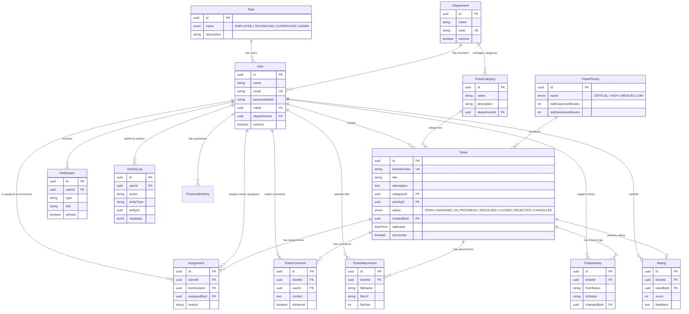

# Dokumentasi Database & Entity Relationship Diagram (ERD)

Sistem HelpDeskPro menggunakan **PostgreSQL** sebagai penyimpanan basis data relasional (RDBMS) utama dengan **Prisma** sebagai ORM (*Object Relational Mapping*).

## Entity Relationship Diagram (ERD)

Diagram berikut mengilustrasikan entitas-entitas dalam sistem beserta kardinalitas relasinya.



## Penjelasan Entitas Utama

1. **User, Role, & Department**: Struktur RBAC dan keorganisasian.
   - `Role`: Menentukan level akses aplikasi.
   - `Department`: Mengelompokkan Karyawan dan Teknisi ke dalam departemen spesifik.

2. **Ticket, TicketCategory, & TicketPriority**: Core entity ITSM.
   - `TicketCategory`: Topik permasalahan yang terikat pada departemen tertentu (contoh: *Network* diurus oleh departemen IT).
   - `TicketPriority`: Mendefinisikan batasan SLA (*Service Level Agreement*).
   - `Ticket`: Tabel sentral pelacakan permintaan pengguna, dilacak melalui kolom `ticketNumber`.

3. **Assignment, TicketComment, & TicketAttachment**: Proses Penyelesaian.
   - `Assignment`: Tabel persimpangan (*junction*) yang melacak teknisi mana yang menangani tiket tertentu, serta siapa supervisor yang menugaskannya.
   - `TicketComment`: Data diskusi tiket, fitur `isInternal` membedakan pesan yang hanya terlihat oleh teknisi & supervisor.

4. **Tracking & Observability**:
   - `TicketHistory`: Mencatat transisi status tiket secara ketat (Audit Trail status).
   - `ActivityLog`: Skema logging general yang menyimpan `metadata` berbasis *JSONB* untuk aktivitas non-status.
   - `Notification`: Catatan notifikasi *in-app* untuk pengguna.

## Indeksasi (Index Strategy)
Kami menerapkan indeksasi komprehensif pada database untuk menjamin performa:
1. Peringatan Dini (SLA): `@@index([isOverdue])` (Opsional/Bisa ditambahkan kelak untuk cron).
2. Tiket Dashboard: `@@index([status])`, `@@index([priorityId])`, `@@index([categoryId])`, `@@index([createdAt])`
3. Keamanan & Lookup: `@@index([email])`, `@@index([code])`

## Default Seed Data
Secara otomatis setelah migrasi `npx prisma db seed` berjalan, basis data akan dihuni oleh:
- 4 Buah Hak Akses (Role): `EMPLOYEE`, `TECHNICIAN`, `SUPERVISOR`, `ADMINISTRATOR`.
- 1 Departemen *Default*: `IT Support`
- 1 User Administrator: `admin@helpdeskpro.local` (Password: `password123`)

## Manajemen Migrasi
1. Tambah atau modifikasi struktur database di `prisma/schema.prisma`.
2. Buat skrip migrasi dengan mengeksekusi perintah:
   ```bash
   npx prisma migrate dev --name deskripsi_perubahan
   ```
3. Migrasi untuk *production*:
   ```bash
   npx prisma migrate deploy
   ```
